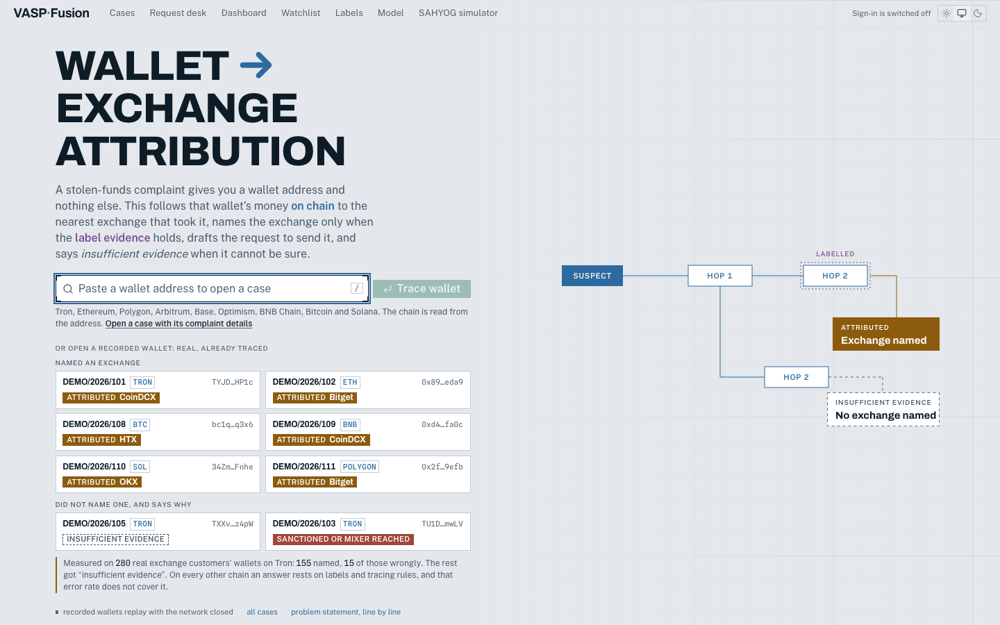
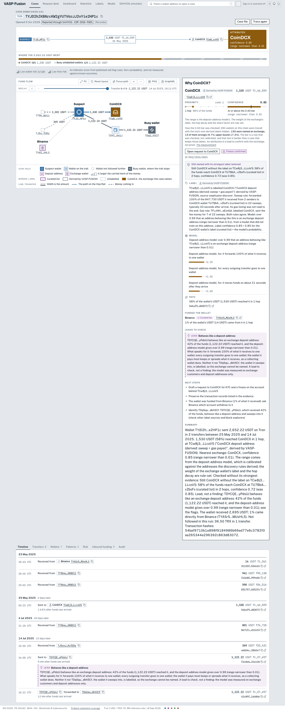
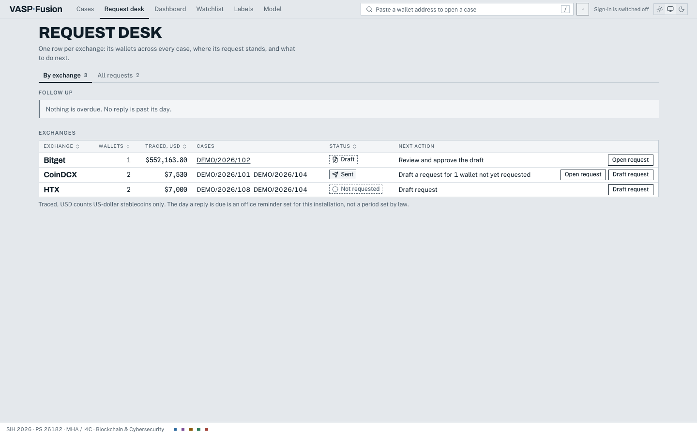
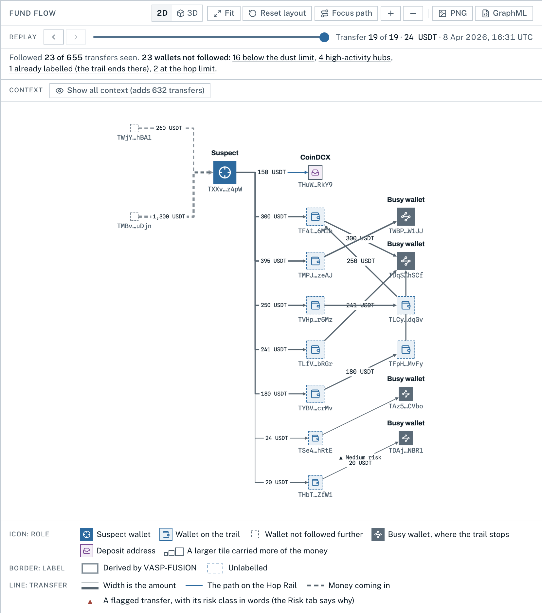
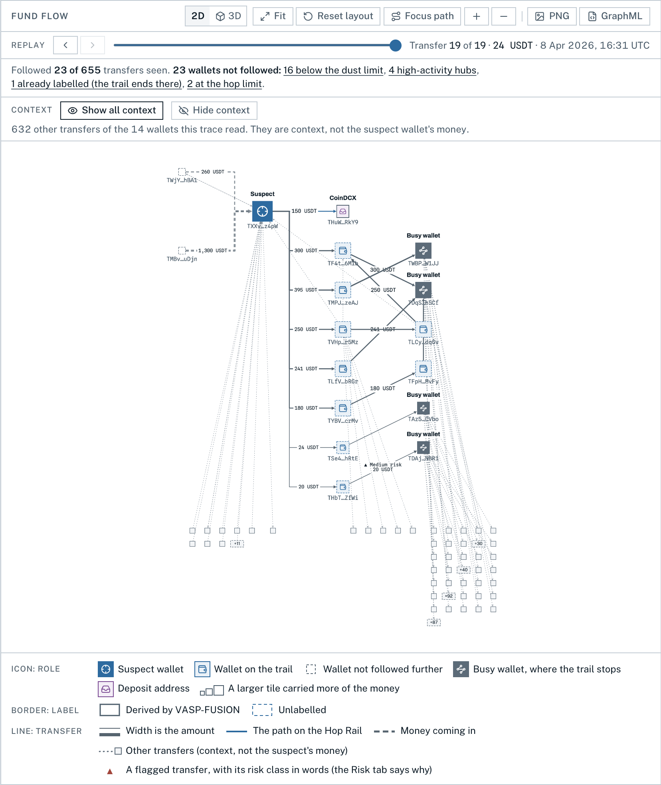
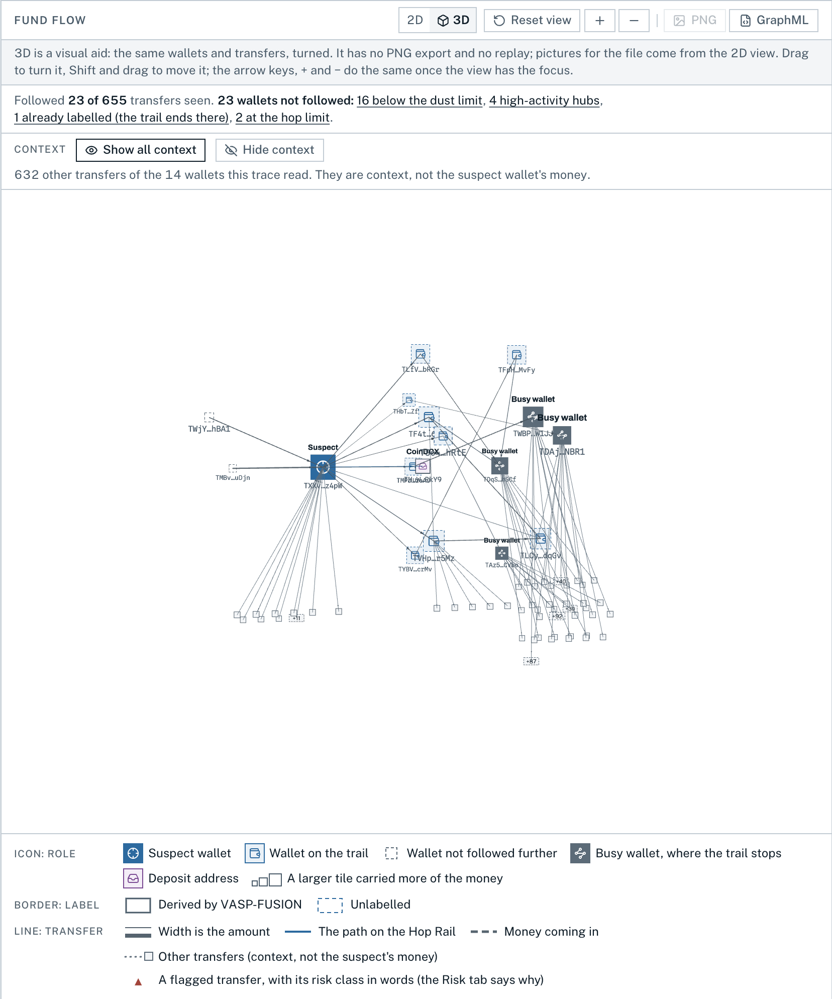

# VASP-FUSION

Given an unknown crypto wallet, find the nearest VASP (exchange, custodial wallet or swap service) that took deposits from it, with a calibrated confidence, an investigation report and a SAHYOG request. SIH 2026 · PS 26182 (MHA / I4C) · Team 112bits.

Forked from our own BTC-FUSION (SIH26146), with the same stack: Python 3.12, FastAPI, Polars, igraph, LightGBM, SHAP and DuckDB; React, Vite, Tailwind and Cytoscape on the front end side.

**On Windows?** Follow [docs/WINDOWS.md](docs/WINDOWS.md) (WSL2).

## For judges: the one-minute version

**The problem.** A stolen-funds complaint gives an investigator one thing: a wallet address. To freeze the money or identify who holds it, the investigator has to know which exchange (VASP) took the deposits, and has to be able to show why.

**What this does.** Paste the wallet. VASP-FUSION follows its money on chain (Tron, Ethereum, Bitcoin), names the nearest exchange that took it, shows the evidence transfer by transfer, gives a confidence that has been measured, and drafts the request to that exchange for the SAHYOG channel. **When the evidence does not hold, it says "insufficient evidence" and says what would change that, instead of guessing.**

**Held to the problem statement.** The screen at `/coverage` lists every line of PS 26182, word for word, with what the tool does about it: **15 lines built, 9 partly built, 0 only planned** (5 Oct 2026; `data/ps_coverage.yaml`, held to the truth by `tests/test_coverage.py`). Each partly built line says what is missing. Two things to know before the demo: **the SAHYOG screen is a simulator** (the portal's interface is not public; `docs/sahyog_contract.md` is our side of a contract, both directions), and **the risk score is an indicator score from published red-flag rules, not a probability, and not measured against known outcomes** (`config/risk.yaml`).

**Check it yourself** (no network needed after the image is built):

```bash
UI=build make docker && make docker-up   # http://127.0.0.1:8000, sign in with demo/officer.json
make demo-flow                           # the 3-minute demo, driven and asserted in a real browser
make reproduce                           # every figure below, regenerated from tracked files
```

**Results.** Every figure is read from a file in this repository; `make reproduce` fails if one no longer matches.

| What was measured | Result | Read from |
|---|---|---|
| Real exchange customers' wallets traced with our own derived labels hidden | 280 | `artifacts/abstain_v1/tron/validation.json` |
| ...of which the tool named an exchange (at the 0.60 bar in use) | 155 | same |
| ...of those, named wrongly | 15 (9.7%; upper bound 17.3%) | same |
| ...and declined to name one ("insufficient evidence") | 125 | same |
| The same test on the other chains, labels one hop away hidden, beside a naive baseline | Ethereum 213 wallets: 69 named, 22 wrongly (31.9%). Bitcoin 96: 28, 2. BNB Chain 84: 19, 0. Polygon 74: 11, 0. Solana 14: 3, 0. Full table below | `artifacts/benchmark_v1/summary.json` |
| Deposit-address model, calibration error (ECE) | 0.0093 | `artifacts/model_v1/tron/metrics.json` |
| Deposit-address model, Brier score | 0.0026 | same |
| Deposit-address model, share of addresses it answers for | 98.6% of 1,791 held out by time and by exchange | same |
| Labelled addresses on file | 474,142 (1,690 published by exchanges, 349,440 curated, 117,515 explorer tags, 5,497 derived here) | `make labels` |
| ...of which carry a threat tag from a cited public source | 18,646: ransomware 11,271, fraud 6,213, terrorism financing 367, darknet market 182, other sanctioned 613 | `make labels`, `data/threat_sources.json` |
| Recorded demonstration cases that replay offline to the same fingerprint | 12 of 12 (7 name an exchange, 3 say insufficient evidence, 2 reach a sanctioned address, one of them listed under a terrorism programme) | `tests/golden/fingerprints.json` |

**Volume.** A batch of wallets is uploaded at `/batch`, queued, and traced by a pool of worker processes (`make serve WORKERS=4`). Measured by `make bench-scale` on one laptop (Darwin arm64, 10 cores, 5 Oct 2026), 300 cases per run, chain responses replayed from a cache, read from `artifacts/scale/metrics.json`:

| Worker processes | Cases per minute | Median seconds per case | Transfers analysed per second | Peak memory |
|---|---|---|---|---|
| 1 | 409.5 | 0.14 | 1,221 | 385 MB |
| 2 | 658.9 | 0.17 | 1,965 | 811 MB |
| 4 | 900.9 | 0.25 | 2,687 | 1,602 MB |
| 8 | 878.5 | 0.40 | 2,620 | 3,040 MB |

Every case in every run reproduces its recorded fingerprint. Before this work the same replay ran at 156.8 cases per minute. Three limits, stated plainly: more than four workers gave no gain on that machine; **live throughput was not measured** (public chain APIs rate-limit free keys, and that is the bound in real use); and it is one machine with one store file. `docs/scaling.md` separates what was measured from what is only design. These timings are a measurement of one machine and are not part of `make reproduce`.

A named exchange is a lead to confirm with the exchange, not proof. The wrongly-named rate above is the honest one: it was measured on wallets whose true exchange we knew and whose labels we hid.

| | | |
|---|---|---|
|  |  |  |
| Paste a wallet, or open a recorded one | The path, the fund-flow graph and why this exchange | One consolidated request per exchange |

**The graph is sparse on purpose, and says so.** It draws the suspect wallet's money only: it stops at a labelled wallet and at a high-activity hub, drops dust, and groups an exchange's wallets. Over every graph one line gives the trace's own counts. For the recorded wallet `tron-abstain`: "Followed 23 of 655 transfers seen. 23 wallets not followed: 16 below the dust limit, 4 high-activity hubs, 1 already labelled (the trail ends there), 2 at the hop limit." The other 632 transfers it read can be switched on as greyed context, for one wallet or for all, and switched off again; they never enter the attribution, the Hop Rail or the risk class. A 3D view of the same picture is one click away; the 2D view stays the one that is exported.

| | | |
|---|---|---|
|  |  |  |
| The counts over the graph; many payers no longer cover the suspect tile | Context on: 632 other transfers, greyed | The optional 3D view |

Rupee amounts are shown beside US dollars at one dated reference rate (`config/fx.yaml`: the RBI reference rate, with its source).

## Run it from a fresh clone
Needs: Python 3.12 with [uv](https://docs.astral.sh/uv/), `make`, and Node 22 for the interface. No API key, no network after the install, and **no data from outside this repository**.
```bash
make setup                 # uv venv (Python 3.12) + install (network once)
make offline-demo          # the recorded labels, the demo cache, the 12 recorded cases checked against their fingerprints, verify
make ui-setup ui-build     # the interface (network once, for npm)
make offline-serve         # http://127.0.0.1:8000, with no network
```
- `make offline-demo` must end with "12/12 as expected" and "12/12 golden fingerprints reproduced". Everything it reads is tracked: the chain responses the traces read (`tests/fixtures/demo/`) and the label rows those traces were answered with (`tests/fixtures/demo/labels.json`).
- **What that label database is.** `make demo-labels` (run by `offline-demo` when there is no `data/labels.duckdb`) writes the 24 real label rows the recorded traces read, exactly as the full label database returned them. The recorded cases give the same findings on it. It is **not** the full label store: the label counts in "Label store" below do not apply to it, the Labels page lists 24 labels, and a wallet that was not recorded meets almost no label. It never replaces a database that is already there.
- Served this way the tool asks for no sign-in (there is no officer account on the machine). The Docker image has the demonstration account in `demo/officer.json`.
- With Docker instead: `make demo-labels && UI=build make docker && make docker-up && make docker-smoke`. The smoke test says which label database the image holds.
- `make test` and `make reproduce` in such a clone: see the note under the prerequisites below.

### Prerequisites for the full label database (`make labels`)
`data/labels.duckdb` is not tracked (73 MB, rebuilt in seconds) and `make labels` builds it from third-party label sets that are **not in this repository**. It reads them from `../research/data` (or `make labels RESEARCH=<path>`):

| Needed | File or folder under `RESEARCH` | Source |
|---|---|---|
| yes | `wallet-attribution/data/*.csv` (one CSV per chain) | the wallet-attribution label set (MIT) |
| yes | `indian_vasps_dune_spellbook.csv` | the Dune spellbook extract of CoinDCX, WazirX and CoinSwitch addresses |
| optional | `graphsense_tagpacks_exchange.csv` | written by `make tagpacks` from `graphsense-tagpacks/packs` (GraphSense TagPacks, MIT, pinned commit) |
| optional | `threats/` | raw files for `make threats`; its output, `data/threat_tags.csv`, **is** tracked |

Tracked and merged in from this repository: `derived/*.csv` (the derived deposit addresses), `artifacts/model_v1/` (their scores), `data/threat_tags.csv`. Without the two needed sets `make labels` stops and says which is missing. The figures in this README that count labels, and `make reproduce`, need the full database. `make test` does not: in a clone with only the recorded demo's labels it passes, and skips the four tests that read the full database.

## Quickstart
```bash
make setup     # uv venv (Python 3.12) + install
make labels    # build data/labels.duckdb from ../research/data and print the stats (see the prerequisites above; `make demo-labels` without them)
make test      # pytest
make serve     # API on http://127.0.0.1:8000  (docs at /docs)
make fetch ADDR=TGjpmhAFT6d7eBKvaFwPVN6H2pDKgLLZiw   # transfers, cached; OFFLINE=1 = cache only
make trace ADDR=TYJD2hZKBNrcKW2gYUTV6rJJ2nYie2HP1c   # wallet -> nearest exchange(s), as an officer reads it
make demo      # the real demo wallets (demo/cases.json) into the case store; OFFLINE=1 replays them
make desk      # the request desk: the exchanges those cases route to, one row each
make letter VASP=CoinDCX OFFICER="Insp. A. Rao"   # one consolidated request -> data/exports/<id>.pdf (a draft; SEND=1 approves and writes it to the mock SAHYOG outbox)
make model     # train, calibrate and measure the deposit-address model; then `make labels`
make abstain-eval   # measure the abstain bar on real customers traced with labels hidden
make benchmark      # attribution on all six chains beside the naive baseline (OFFLINE=1 replays the cache)
make case-pdf CASE=tron-coindcx   # the case file (A4 PDF) and its receipt -> data/exports/
make verify    # trace every stored case again from the cache only and compare fingerprints
make audit     # check the audit log's hash chain
make reproduce # regenerate every artifact that comes from tracked files; fails if one changed
make docker && make docker-up     # the offline image on http://127.0.0.1:8000
make docker-smoke                 # the whole demo inside a container with no network
```
Contract work: `make mocks` regenerates `mocks/` (seeded), and `make types` regenerates `docs/openapi.json` and `ui/src/api/types.ts`.

The interface (`ui/`, design system in `ui/DESIGN.md`): `make ui-setup` once, then `make ui-dev` (demo fixtures; `make ui-dev API=live` talks to `make serve`), `make ui-test`, `make ui-build` (then `make serve` serves it at `/`). Every component in every state is at `/kit`.

## Offline demo in Docker
```bash
make labels          # once: the image bakes data/labels.duckdb in (`make demo-labels` in a clone without the label sets)
make docker          # build vasp-fusion:offline (needs the network once: base images, wheels)
make docker-up       # http://127.0.0.1:8000; sign in with the account in demo/officer.json
make docker-smoke    # 82 checks in a throwaway container started with --network none
UI=build make docker # the same image with the interface compiled in (what the demo uses)
make demo-flow       # drives the 3-minute demo in a real browser against :8000 and asserts every step
```
- **Nothing reaches the network at run time.** The image sets `OFFLINE=1`: a chain request that is not in its cache is refused, never fetched. `make docker-smoke` proves it by running the whole demo with networking disabled.
- **What is baked in:** the label database; the chain responses the twelve demo wallets' traces read, replayed from the tracked recordings in `tests/fixtures/demo/` into a cache (`cli demo-cache`, no network); the twelve demo cases, traced while the image is built. **The build fails unless every case reproduces its golden findings fingerprint (`tests/golden/fingerprints.json`) and verifies.**
- **The interface.** `UI=build make docker` compiles `ui/` into the image (Node 22 stage; the build checks that the bundle carries no fixture and that the first load stays under 200 KB gzipped). The demo script is `docs/demo_script.md`. Without `UI=build` the API serves a plain console page at `/`: sign in, the cases with their case files and receipts, a Verify button, the desk, the audit log.
- **Only real records.** The fixtures in `mocks/` stand in for empty stores only with `VASPFUSION_DEMO_MODE=1` (off by default, off in the image): a server lists its own cases and nothing else.
- **Login.** The image holds one demonstration account (`demo/officer.json`, published in the repository, so it protects nothing). `VASPFUSION_AUTH=off docker compose up` runs without a login. For real use, disable it and add officers: `docker compose exec vasp-fusion python -m vaspfusion.cli officer add <user> --name "..."`.
- **State** (cases, requests, audit log, token secret) lives in the volume `vaspfusion-data`. A rebuilt image does not replace it: `docker compose down -v` starts again from the image's demo data.
- The container runs as a non-root user with a read-only root filesystem and no Linux capabilities, bound to 127.0.0.1.
- To carry it to an air-gapped machine: `docker save vasp-fusion:offline | gzip > vasp-fusion.tar.gz`, then `docker load` there.
- A live trace from the container needs `OFFLINE=0` and real keys (`ETHERSCAN_API_KEY`, `TRONGRID_API_KEY`) in the environment.

## Case file, receipt, verify
```bash
python -m vaspfusion.cli case-pdf <case id>       # data/exports/case-<id>.pdf + .receipt.json
python -m vaspfusion.cli verify <case id>         # or --all, or --receipt file.json
```
- Sentences in the case file keep the short form of an address (first six and last six characters) exactly as the trace wrote it; the file never expands one, because a look-alike address would be indistinguishable. Every wallet of the case is listed in full in its wallet table. A case reference in a script other than Latin prints as question marks (standard PDF fonts).
- **The case file** (`GET /api/cases/{id}/pdf`): result, summary, where the funds went, a flow diagram with every wallet numbered and listed in full, each exchange reached with its evidence and transaction hashes, the path, patterns, leads, how the confidence was worked out (what is calibrated and what is not, and how the 0.60 bar was checked), what would change it, next steps, limitations, and the receipt. **The same case gives the same bytes**; every page's footer carries the findings fingerprint.
- **The receipt** is part of every case (`provenance`) and a document of its own (`GET /api/cases/{id}/receipt`): SHA-256 of the input (wallet, chain, hop limit, start date), of every chain response the run read (each listed, with one digest over all), of the label database and of the model; the code version, git commit and seed; the **findings fingerprint**, a digest over every figure, address, time and transaction hash of the result and none of its wording; and a content digest over the result with its wording. The case reference, complaint number and amount lost are the officer's entries and are covered by neither.
- **Verify** traces the wallet again from the cached responses only (it never fetches) and compares. It passes when the stored case still has its own digests, the same responses were read byte for byte, the new result has the same fingerprint, and its text is the same too (a difference in wording is accepted, and said, only when the code or the label database has changed since). The digests are not keyed, so a digest alone proves nothing: the replay does. A receipt on its own is checked the same way, and its stated outcome, exchange and confidence must be what the trace gives.
- Golden files: `tests/golden/` holds each demo wallet's fingerprint and its case file as text. `python tests/refresh_golden.py` rewrites them after a deliberate change; read the diff.

## Login and audit
```bash
python -m vaspfusion.cli officer add a.rao --name "Insp. A. Rao" --post "Cyber Crime PS"
python -m vaspfusion.cli officer list | disable <user>
python -m vaspfusion.cli audit [--officer a.rao] [--action case] [--target <case id>]
python -m vaspfusion.cli audit --verify
```
- **A login is required once an officer account exists** (disabled or not), or with `VASPFUSION_AUTH=required`. With none, the tool runs as a single-officer workstation and the log records "not signed in". `VASPFUSION_AUTH=off` forces it off.
- Accounts live in `data/officers.json` (scrypt hashes, a salt each; git-ignored). Five wrong passwords lock a user name for five minutes; attempts are counted before the password is checked, and a name with no account locks the same way. Accounts are made on the command line, not through the API.
- Tokens are HS256 JWTs, valid 8 hours, sent as `Authorization: Bearer` or the HttpOnly, SameSite=Strict session cookie the login sets. The signing secret is `VASPFUSION_JWT_SECRET`, or 32 random bytes written once to `data/auth_secret`.
- **Every `/api` request leaves one audit row** (`data/audit.duckdb`): who, which action, on which case, wallet, exchange or request, and the status. Never a request body. A refused request is a row too. The same read repeated within 30 seconds is one row.
- **The log is hash-chained and keyed:** each row's hash is an HMAC-SHA256 of the row and the hash before it, so an edited, removed or reordered row breaks the chain from there, `audit --verify` names it, and the log cannot be rewritten and rehashed without the key. The key is `VASPFUSION_AUDIT_KEY` (keep it off this machine's disk if you can), or else a file made beside the log (`data/audit.duckdb.key`). Whoever holds both the log and the key can rewrite it, and rows cut off the end leave a valid chain: note the head hash somewhere else (`audit --verify` prints it) to catch both.
- A request's status history records the signed-in officer who drafted, approved and sent it.
- Limits: one server process; a token cannot be revoked before it expires except by disabling its account; no roles (every officer can read the log).
- No file upload exists in this tool, so there is nothing to sandbox; cross-origin writes are refused (403), and every API reply is `no-store`, `nosniff`, not frameable.

## Reproduce
`make reproduce` regenerates, with no network: the label database, both models (trained from the tracked `dataset.csv`), the abstain measurement (from the tracked `claims.csv`), the six-chain benchmark (from the tracked `wallets.csv` of each chain), the demo's chain cache (from the recorded fixtures), the twelve demo cases (checked against the golden fingerprints, then verified), the golden case files, the mocks and the OpenAPI schema; then runs the tests. It then compares every tracked artifact with what git holds. Only `trained_at` in a model's `metrics.json` may differ. `--full` also replays discovery, the model's dataset and the abstain traces from the crawl caches where they are on the machine.

## Layout
| Path | What |
|---|---|
| `vaspfusion/labels/` | Label store: normalise → build (tier-ranked dedupe) → lookup/search |
| `vaspfusion/chains/` | Chain adapters (Tron, EVM incl. BNB Chain, Bitcoin, Solana) behind a cache-first fetcher; the only code that reaches the network |
| `vaspfusion/cluster.py` | Bitcoin: an address spent together with a labelled exchange address takes that exchange's label, with the cluster as evidence |
| `vaspfusion/trace.py` | Bidirectional trace: follows the wallet's money hop by hop, allocating by amount |
| `vaspfusion/attribute/rules.py` | Candidates, proximity rank, rule confidence, the three outcomes |
| `vaspfusion/discover/` | Deposit-address discovery: the sweep and gas-payer rules, the crawler, the hold-out evaluation |
| `derived/` | What discovery found (`<run>.csv`, `<run>_report.json`) and the hold-out result; `make labels` merges the CSVs |
| `vaspfusion/classify/` | The deposit-address model: features, dataset, splits, training + calibration, SHAP reasons, label scores |
| `artifacts/model_v1/<chain>/` | The model's dataset, measurements, plots, label scores and the model itself as LightGBM text (`model.txt`), all tracked |
| `vaspfusion/detect/typologies.py` | Typology flags over the traced money, each with figures and hashes |
| `vaspfusion/attribute/counterfactual.py`, `leads.py` | Does a named exchange survive without its label; unlabelled wallets that behave like deposit addresses |
| `vaspfusion/eval/benchmark.py`, `vaspfusion/eval/model_gate.py`, `artifacts/benchmark_v1/` | Attribution measured on six chains beside a naive baseline; the rule that decides which chain's deposit model is used when tracing |
| `vaspfusion/eval/abstain.py`, `artifacts/abstain_v1/` | The abstain bar measured by hiding labels: claims, risk vs coverage |
| `vaspfusion/explain/case_narrative.py` | The paragraph an officer reads |
| `vaspfusion/cases.py`, `vaspfusion/store/cases.py` | `run_case` → the API's `CaseDetail`; cases in `data/case.duckdb` |
| `vaspfusion/provenance.py` | The receipt: digests of the input, the responses, the findings; `verify_case` |
| `vaspfusion/explain/case_file.py`, `flow.py`, `case_pdf.py` | The case file: what it says (blocks, text), the flow diagram's layout, the A4 PDF |
| `vaspfusion/desk/`, `data/vasp_directory.yaml` | The request desk: routing, the cited exchange directory, letters, the mock SAHYOG gateway |
| `vaspfusion/desk/intake.py`, `vaspfusion/store/complaints.py`, `docs/sahyog_contract.md` | SAHYOG, both directions: complaints in (one case per wallet, traced at once), results back, replies in; the simulator's routes |
| `vaspfusion/risk.py`, `config/risk.yaml` | The wallet and flow risk score: named indicators with points, the class, the sentence and transactions behind each |
| `vaspfusion/coverage.py`, `data/ps_coverage.yaml`, `docs/problem_statement.md` | The problem statement line by line with status, evidence and gap (`/coverage`) |
| `vaspfusion/auth/`, `vaspfusion/store/audit.py`, `vaspfusion/api/security.py` | Officer accounts and tokens; the hash-chained audit log; login and audit in front of the API |
| `vaspfusion/api/` | `schemas.py` (the contract), `main.py` (routes; only the dashboard and the three fixture cases still answer from mocks), `console.html` (served at `/` when no interface is built) |
| `vaspfusion/{graph,features,detect,eval}/`, `explain/narrative.py`, `store/dao.py` | Carried over from BTC-FUSION |
| `demo/cases.json`, `demo/officer.json` | Seven real demo wallets and the result each must give; the demonstration login |
| `tests/golden/` | Each demo wallet's findings fingerprint and case file as text |
| `Dockerfile`, `docker-compose.yml`, `requirements.lock`, `scripts/docker_smoke.py` | The offline image |
| `scripts/reproduce.py` | `make reproduce` |
| `docs/api_contract.md` | Endpoints, conventions, mock rules |
| `mocks/` | Demo fixtures for the UI track (labelled addresses real, the rest synthetic, all marked `_demo`) |

## Label store
One row per `(address, chain)`: `entity, category, kind, tier, source, source_url, label`, plus `confidence` and `evidence` on `derived` rows, and `confidence_low`, `confidence_high` and `model` (the deposit-address model's probability, range and reasons) on the derived rows the model scored.
- Tier priority: `published_por > curated > explorer_tag > derived`. A derived row never replaces a label from another source.
- EVM addresses are lowercased; Tron and BTC keep their case.
- Dune "EVM" rows are stored as chain `evm` and match any EVM chain on lookup.
- Sources: the wallet-attribution set and the Dune spellbook extract (115,242 labels), the derived deposit addresses, and the exchange packs of the **GraphSense TagPacks** (MIT, pinned to one commit): 336,531 exchange tags on Bitcoin, Ethereum and Tron, of which 336,208 are BitMEX's own published address list and 120 are WalletExplorer's named exchange wallets. `make tagpacks` flattens the packs in `research/data/graphsense-tagpacks/` into the CSV `make labels` reads.

```python
from vaspfusion.labels.lookup import lookup, LabelStore
lookup("TAa8e7U7seCy7NcZ52xYVQXXybFfwvsUxz", "tron")   # Label(entity='Bitget', tier='published_por', ...)
```

## Threat tags and high-risk alerts
A label can carry a **threat** beside its category: `terrorism_financing`, `ransomware`, `darknet_market`, `fraud` or `sanctioned_other`, with who the source names (`threat_entity`), the source (`threat_source`, `threat_url`) and the source's own words (`threat_evidence`). The tool never infers a threat: every tag is a public source's statement, and `config/threats.yaml` holds each rule.

| Source | Licence | Fetched | What is read |
|---|---|---|---|
| OFAC SDN list, the official XML (published 2 Oct 2026) | US-government public record | 5 Oct 2026 | Every digital-currency address with its entry's **programme codes**. `SDGT` or `FTO` → terrorism financing. Twelve entries whose programme does not say what they are (Hydra, the Nemesis administrator, REvil, SamSam, LockBit and IRGC-affiliated ransomware actors, the Prince Group chairman) are tagged by SDN uid from the Treasury press release of their designation, cited in the config. Everything else → `sanctioned_other`, programme kept |
| Ransomwhere export | CC BY 4.0 (doi:10.5281/zenodo.13999026) | 5 Oct 2026 | 11,186 Bitcoin ransomware payment addresses; the family is the entity |
| GraphSense TagPacks, commit `b556978` | MIT | 5 Oct 2026 | Tags whose own `abuse` field says ransomware, terrorism, scam, phishing, Ponzi, investment fraud or pyramid scheme; `category: market` in the Hydra and WalletExplorer packs |
| The scam lists already in the store | as on record | | Rows filed `scam` are tagged `fraud` in their own words |

- `make threats` flattens the raw files (`../research/data/threats/`) into the tracked `data/threat_tags.csv` (18,446 addresses) and writes `data/threat_sources.json` (sources, licences, fetch date, counts, what was skipped and why). `make labels` joins the file on: 1,429 tags sit on a label already held, 17,017 addresses got a label of their own (a listed address is `sanctioned`, a fraud address `scam`, anything else a named `entity`; **no category was added**).
- Skipped, with the reason on record in the config: sextortion spam and extremism packs (neither is one of the four ecosystems), exchange hacks, `etherscan-wordcloud-market` (NFT marketplaces), the LockBit-tattoo recipients. Two `sanctioned` rows of the older list are not in the current SDN XML and carry no tag.
- **In a trace:** money that reaches (or came from) a tagged address raises a high flag that names the threat, the entity, the source and the transactions: `threat_contact` ("Linked to ransomware (Conti, Ransomwhere): 2 hops away, 14% of the funds …"); a sanctioned or mixer address that also carries a tag keeps its own flag and gains the tag. The outcome rules are unchanged.
- **On intake:** `POST /api/cases` looks the address up before the trace starts, so the answer already carries `screening` (a direct hit, or that there is none).
- **Alerts:** the dashboard's alerts and the watchlist's changes carry the tag; a re-check that finds a link the baseline did not have is a `new_threat_link`. The wallet page reads High with the list entry's words. Labels and cases filter by threat (`?threat=`).
- **Chainabuse is not read.** `CHAINABUSE_API_KEY` may be set; nothing uses it yet.
- The recorded case `tron-terror-link` (`DEMO/2026/112`) is a real Tron wallet: 28% of the 115,903 USDT it sent went, one hop away, to two addresses the SDN list files under ISIL Khorasan (programmes FTO and SDGT). Nothing here alleges anything about whoever controls the wallet.

## Chain adapters
```python
from vaspfusion.chains import get_provider, detect_chain
p = get_provider(detect_chain("TGjpmhAFT6d7eBKvaFwPVN6H2pDKgLLZiw"))   # tron
p.transfers("TGjpmhAFT6d7eBKvaFwPVN6H2pDKgLLZiw", "in", since=None, limit=200)
# -> [Transfer(chain, tx_hash, block_time, from_addr, to_addr, asset, amount, amount_usd, fee_payer, asset_contract)]
```
| Chain | Source | Key (optional) |
|---|---|---|
| tron | TronGrid `/v1/accounts/{a}/transactions/trc20` (USDT) + `/transactions` (TRX) | `TRONGRID_API_KEY` |
| ethereum, polygon, arbitrum | Etherscan v2 with a key, else Blockscout | `ETHERSCAN_API_KEY` |
| base, optimism | Blockscout (keyless) | – |
| bsc (BNB Chain) | Ankr Advanced API, JSON-RPC `ankr_getTransactionsByAddress` + `ankr_getTokenTransfers` (free plan; Etherscan's free plan refuses this chain). Etherscan v2 instead when `ETHERSCAN_PAID=1` | `ANKR_API_KEY` (**needed**) |
| bitcoin | Esplora `/api/address/{a}/txs`: blockstream.info, or mempool.space with `VASPFUSION_BTC_API=mempool.space` (same API; a replay needs the backend it was recorded from) | – |
| solana | Helius parsed history `/v0/addresses/{a}/transactions` (free plan): SOL and SPL transfers between the owning wallets, not the token accounts | `HELIUS_API_KEY` (**needed**) |

- Keys come from the process env, then `.env` (never committed). They are never printed, cached or written to fixtures.
- Every response is cached raw in `data/chain_cache.duckdb` with its SHA-256, keyed by `(chain, address, direction, query)`. Re-runs replay from the cache; `--refresh` re-fetches. **`OFFLINE=1`** serves only from the cache and fails loudly on a miss.
- Tests replay responses recorded once from the live APIs (`scripts/record_chain_fixtures.py` → `tests/fixtures/chains/`); CI needs no network.
- Tokens other than the known USDT/USDC contracts are named `SYMBOL@contract`, so a fake "USDT" never passes as USDT.

## Deposit-address discovery
```bash
make discover        # three Tron runs -> derived/*.csv (cached; OFFLINE=1 replays byte-identical)
make labels          # merges the derived rows into the label DB as tier=derived
make discover-eval   # hold-out test on explorer-tagged addresses -> derived/holdout_*.json
```
Starting from an exchange's labelled wallets, every address that paid stablecoins into one of them is a candidate. Two rules decide (`vaspfusion/discover/rules.py`):
- **Sweep rule.** The address forwarded at least 90% of the stablecoins it received to labelled wallets of one exchange, each part within 7 days of arriving. Sweeps are paired with the newest deposits; an idle balance counts against the share.
- **Gas-payer rule.** Whoever delegated energy or sent 1 to 100 TRX to the address in the hour before a sweep (or signed the sweep) is its payer. A payer that is a labelled wallet of the same exchange confirms the sweep rule. A payer of another exchange is a **conflict**: recorded in the CSV, never a label.
- An unlabelled payer that serves 10 or more of these addresses, 95% of them one exchange's, is reported as that exchange's **gas station** (in `<run>_report.json`, not as a label: an energy seller would look the same).
- Each derived label carries a rule confidence = the attribution weight of the wallet it sweeps to × 0.95 (both rules agree), 0.90 (gas station) or 0.80 (sweep rule only), and `evidence`, the paragraph an officer reads. That confidence is hand-set, not calibrated; where the deposit-address model confirms the label, the label carries the model's value instead (next section).
- A derived label never replaces a label from another source, and two runs that name different exchanges for one address load neither.

**Result (1 Oct 2026, `derived/`):** 122 labelled Tron exchange wallets → **5,497 derived deposit addresses**: OKX 1,742 · Gate.io 1,134 · KuCoin 958 · Bitget 755 · CoinDCX 558 · Bitfinex 217 · Bitrue 133 (HTX and WazirX: none). 3,773 by both rules, 1,711 by sweep + gas station, 13 by the sweep rule alone; no conflicts. 811 have a listing that was cut at 50 rows, and their evidence says so.

**Measured on held-out explorer tags** (`derived/holdout_ethereum_bitget.json`; Ethereum, because our data has no tagged Tron deposit addresses): of 300 Etherscan-tagged Bitget deposit addresses, labels hidden, the rules rediscovered 66 (**recall 22.0%**; 230 never held a stablecoin, which is all the rule reads; among the 70 that did, **94.3%**). None was given to the wrong exchange. On 300 tagged addresses that are not deposit addresses the rule fired on 24 of 150 exchange wallets (16.0%) and 0 of 150 others; all 24 named the exchange their own tag names.

## Deposit-address model
```bash
make model-data                       # the Tron training set (cached; OFFLINE=1 replays byte-identical)
make model                            # train, calibrate, measure, score the derived labels
make labels                           # merge the scores into the label DB
make model-data MODEL_CHAIN=ethereum  # the explorer-tagged benchmark
make model MODEL_CHAIN=ethereum
```
A LightGBM model (`vaspfusion/classify/`) says how likely an address is an exchange deposit address from what it does. It reads 14 behaviour features of one address and no label: how much of what it receives it forwards to one wallet, how fast, how many wallets pay it and are paid by it, who covers its network fees, and whether the wallet it pays most forwards everything on in turn (a deposit address does; a collecting wallet does not). Venn-Abers turns its score into a probability with a range; SHAP gives the reasons, written in plain words.

- **Both classes are read the same way:** the same listings, the same start date, the same row limit, nothing later than the run's last positive transfer, and only the first 14 days of each address. An address is judged without its own label.
- **Never split at random.** By time (earliest 60% train, next 20% calibrate, last 20% test) and by exchange (everything of one exchange held out). `eval/splits.verify` rejects a leak.
- **The two features that read exchange labels are an ablation, not part of the model.** On Tron the positives were picked by those labels, so a model that reads them is the rule again.
- **Labels carry cross-fit scores:** each exchange's addresses are cut into 5 blocks by time and each block is scored by a model trained on the other blocks. No address is scored by a model that trained on it.
- **The model can confirm a label, not overrule it.** A derived label carries *weight of the exchange wallet's label × the model's probability*, with its range, when that is at least the rules' confidence. Otherwise the rules' confidence stays and the evidence says why. The model cannot see the sweep into a labelled exchange wallet, so it must not veto it.

**Measured (2 Oct 2026, `artifacts/model_v1/`, seed 26182):**

*Tron*, 8,952 real addresses: the 5,497 derived deposit addresses, 3,434 wallets that paid into them, 21 labelled exchange wallets. **The truth here is the discovery rules' verdict**, so these numbers say how well behaviour alone recovers what rules and labels found.

| How it was tested | n | PR-AUC | ROC-AUC | Brier | ECE | Precision | Recall |
|---|---|---|---|---|---|---|---|
| By time (latest 20%) | 1,791 | 1.000 | 1.000 | 0.0026 | 0.0093 | 0.994 | 1.000 |
| By exchange, pooled (never saw the exchange) | 8,950 | 0.9989 | 0.9985 | 0.0140 | 0.0293 | 0.998 | 0.9935 |
| Cross-fit (the labels' scores) | 8,952 | 0.9995 | 0.9994 | 0.0044 | 0.0076 | 0.999 | 0.9935 |

- The bar is not chance: the single rule "forwards 90% or more to one wallet" already gives precision 0.934 and recall 1.000 by time, because the positives were chosen for that. The model's gain is on the look-alikes: of the 418 other wallets that also forward 90% or more, a model that never saw the exchange calls 10 a deposit address (2.4%); the rule calls all 418 one.
- By exchange: PR-AUC is 1.000 for Bitfinex, Bitget, Bitrue, Gate.io, KuCoin and OKX, and 0.980 for CoinDCX (recall 0.943: 30 of its addresses sweep into a wallet that forwards on again).
- The model confirms 5,249 of the 5,497 derived labels; 248 keep the rules' confidence (36 of them because the model does not recognise the behaviour).
- Not measured: a wallet that never dealt with an exchange is not in the sample, and the probabilities are calibrated at this dataset's class mix.

*Ethereum*, 1,467 real addresses, **a truth our rules never saw**: 599 explorer-tagged deposit addresses (Bitget, and "Binance Dep" filed upstream under `bilaxy`), 271 tagged addresses that are not deposit addresses, 597 wallets that paid into the deposit addresses.

| How it was tested | n | PR-AUC | ROC-AUC | Brier | ECE | Precision | Recall |
|---|---|---|---|---|---|---|---|
| By time (latest 20%) | 294 | 0.955 | 0.980 | 0.057 | 0.056 | 0.803 | 0.981 |
| By exchange, pooled | 1,196 | 0.762 | 0.786 | 0.371 | 0.385 | 0.909 | 0.100 |
| Cross-fit | 1,467 | 0.950 | 0.972 | 0.061 | 0.028 | 0.892 | 0.895 |

- The one rule alone gives precision 0.55 and recall 0.56 here; the model gives 0.80 and 0.98.
- **By exchange it fails:** with two exchanges, each model learned deposit addresses from one exchange only, and what it learned did not carry over (recall 0.10). On Tron, with six exchanges to learn from, it did.
- Reading the exchange's other labelled wallets (the two ablation features) lifts PR-AUC by time from 0.955 to 0.975 on this truth, where the labels did not pick the positives.

Plots: `reliability.svg`, `reliability_by_exchange.svg`, `reliability_labels.svg`, `importance.svg` in each chain's folder.

## Attribution measured on every chain, beside a naive baseline
```
make benchmark                    # samples, traces and scores; fetched pages go to data/benchmark_cache/
OFFLINE=1 make benchmark          # replays the cache: the same files byte for byte
python -m vaspfusion.cli benchmark --from-wallets     # measure again from the tracked wallets.csv
```
Measured on 7 Oct 2026, seed 26182, naming bar 0.60 (`vaspfusion/eval/benchmark.py`; per chain `artifacts/benchmark_v1/<chain>/sample.csv`, `wallets.csv`, `validation.json`; the table is `summary.json`). Every figure is a count of wallets, beside its sample size.

| Chain | Wallets traced | Named | Named wrongly (95% upper bound) | Insufficient evidence | Baseline named | Baseline wrongly | Median s / trace |
|---|---|---|---|---|---|---|---|
| Tron | 280 | 155 | 15 of 155 (9.7%; at most 14.5%) | 125 | 248 | 39 of 248 (15.7%; at most 20.0%) | not recorded |
| Ethereum | 213 | 69 | 22 of 69 (31.9%; at most 42.3%) | 144 | 100 | 40 of 100 (40.0%; at most 48.7%) | 13.4 |
| Bitcoin | 96 | 28 | 2 of 28 (7.1%; at most 20.8%) | 68 | 43 | 8 of 43 (18.6%; at most 31.1%) | 15.4 |
| BNB Chain | 84 | 19 | 0 of 19 (0.0%; at most 14.6%) | 65 | 23 | 4 of 23 (17.4%; at most 35.5%) | 11.4 |
| Polygon | 74 | 11 | 0 of 11 (0.0%; at most 23.8%) | 63 | 16 | 3 of 16 (18.8%; at most 41.7%) | 13.0 |
| Solana | 14 | 3 | 0 of 3 (0.0%; at most 63.2%) | 11 | 3 | 0 of 3 (0.0%; at most 63.2%) | 21.4 |

Named, by hops to the exchange. Tron: 154 at two hops (14 wrong), 1 at three (wrong). Ethereum: 67 at two hops (20 wrong), 2 at three (both wrong). Bitcoin: 12 at zero hops (1 wrong), 10 at one hop (1 wrong), 6 at two hops (0 wrong). BNB Chain 19, Polygon 11 and Solana 3, all at two hops, none wrong.

**The protocol, fixed before any wallet was sampled.**
1. **Wallets.** On each chain the eight exchanges with the most labelled addresses; each one's addresses shuffled with the seed, the first 40 probed (one listing of 100 inbound USDT and USDC transfers each; BTC on Bitcoin); senders of at least 10 USDT/USDC or 0.001 BTC that carry no label, taken round-robin over the addresses up to 30 per exchange on Ethereum and 12 elsewhere. Tron keeps the 280 wallets of the earlier run.
2. **Hidden.** Every exchange, custodial or swap-service label on an address the wallet paid directly, and the label of the sampled address in any case. Nothing two or more hops out. On Tron only the 5,497 derived deposit labels were hidden, and claims one hop away are left out of every figure, as before.
3. **Traced** with the pipeline as a case runs it (3 hops, 40 wallets, 100 transfers a listing), from the time of the sampled payment.
4. **Scored.** A name is right when it is the sampled exchange or the owner of another hidden label. The upper bound is one-sided Clopper-Pearson at 95% on the error among the wallets named.
5. **Baseline.** The nearest labelled exchange the same trace reached, whatever its confidence; it never abstains when anything was reached. It shares the tracer, so the two columns differ by the decision to abstain and nothing else.

**What it shows.** On every chain the tool names fewer wallets than the baseline and is wrong less often: abstaining removed 24 of the baseline's 39 wrong names on Tron, 18 of 40 on Ethereum, 6 of 8 on Bitcoin, all 4 on BNB Chain and all 3 on Polygon. **On Ethereum the error is still high: 22 of 69 names were wrong (31.9%; at most 42.3%).** Most wallets on every chain other than Tron got "insufficient evidence", and the commonest reason is that the money stopped at a busy unlabelled wallet (Ethereum 83 of 144, Polygon 35 of 63, BNB Chain 25 of 65) or at one whose listing was cut off (BNB Chain 26, Polygon 14, Ethereum 9); on Ethereum another 31 reached an exchange but under the bar: with its label hidden, an exchange's hot wallet is exactly that.

**Limits, stated plainly.**
- The Tron row is not like for like with the others: different wallets (the deposit model's customers), different labels hidden (our own derived ones).
- A name counts as wrong whenever it is not an exchange the wallet paid directly. Some "wrong" names may be real payments to that other exchange through an intermediary; that was not checked.
- A sender into an exchange's hot wallet can be the exchange's own unlabelled deposit address, another service, or a contract. On Bitcoin 12 of the 28 named wallets were named at zero hops: the wallet itself sits in a co-spend cluster with labelled addresses of the exchange, so it is an exchange's wallet, not a customer's. Another 10 were named at one hop, where the cluster rule gave the hidden address its owner back.
- **Solana has 14 wallets, not the 60 aimed for.** The adapter reads the oldest 500 transactions of an address and few of those are stablecoin payments in; only 11 of the 86 labelled addresses had an eligible sender. Bitget on Ethereum gave 23 of 30 and Deribit 10 of 30 for the same reason (most tagged deposit addresses never received a stablecoin).
- BNB Chain, Polygon and Solana hold few exchange labels (94, 34 and 86), so there is little for a hidden-label trace to find again. With 0 wrong among 19, 11 and 3 names the upper bounds are wide (14.6%, 23.8%, 63.2%).
- Seconds are per trace as fetched live with free keys, provider waits included. Blockstream refused requests part-way through the Bitcoin run; it was resumed at one call every three seconds, and 25 Bitcoin wallets whose pages were already cached have no time recorded. The Tron run did not record times.
- Every wallet here paid an exchange. Nothing measures a wallet that never did.

**Is the confidence informative?** Compared on the wallets where the trace reached any exchange (the confidence and correctness of the nearest one; bins fixed in advance; `calibration` in each `validation.json`). Ethereum, 100 wallets: confidence 0.60 to 0.75 was right 67.7% of the time (65 wallets) and under 0.30 right 40% (20), so the ordering is there, but the Brier score (0.243) is no better than quoting the overall share right (0.240). Tron, 248 wallets: under-confident throughout (claims stated under 0.30 were right 75% of the time, those at 0.75 to 0.90 right 92%), Brier 0.236 against 0.133 for a constant. By the test fixed in advance the confidence is **not informative as a probability on either chain**; it is a rule-set score that orders answers, and the bar on it is what was measured. Bitcoin (43 wallets, Brier 0.200 against 0.151) likewise. BNB Chain is the exception on a small sample: of 23 wallets the 19 at 0.60 or more were all right and the 4 below it all wrong (Brier 0.092 against 0.144). Polygon (16) and Solana (3) have fewer than the 20 wallets fixed as the minimum, so nothing is said about them.

**The Ethereum deposit model stays off when tracing.** Rule fixed in advance: switch it on only if at least 30 addresses of an exchange the model never saw score 0.90 or more and the 95% upper bound of the share of them that are not deposit addresses is within 17.3% (the bound of the naming error on Tron). Measured on the leave-one-exchange-out predictions (1,196 addresses, two exchanges): 27 scored 0.90 or more, none wrongly (upper bound 10.5%), which is 4.5% of the 599 deposit addresses. It fails on the count, not on the error, so `SCORED_CHAINS` is unchanged and no recorded case changed.

## The abstain bar, measured
```bash
make abstain-eval                 # 280 real wallets traced twice (cached; OFFLINE=1 replays byte-identical)
python -m vaspfusion.cli abstain-eval --from-claims   # measure again from the tracked claims.csv
```
No exchange is named below confidence 0.60. There is no labelled set of "wallet → exchange" cases to pick that bar on, so one is built by hiding labels (`vaspfusion/eval/abstain.py`):
- **Wallets:** 280 real Tron wallets (40 per exchange, seed 26182) that paid an address the discovery rules derived as a deposit address. **Known answer:** the exchanges each paid directly, from the full label store.
- **Test:** each is traced from the start of its discovery window with all 5,497 derived labels hidden, so the exchange must be found through an unlabelled wallet. Each exchange reached is a claim; it is right if it is in the known answer. A claim through a wallet the rules did not derive counts as wrong, although that wallet may be a deposit address the rules missed.
- **Result** (`artifacts/abstain_v1/tron/validation.json`): 303 claims, 224 right. At 0.60, 155 of the 280 wallets get an exchange named, 15 of them wrong (9.7%; upper bound 17.3%, one-sided Clopper-Pearson over wallets, corrected for the nine bars tried), and 125 abstain. At 0.80: 121 named, 8 wrong (6.6%; bound 14.6%). **No bar on the grid brings the bound under 5%**, so the measurement does not single out a bar and 0.60 stays a rule-set value. Claims three hops away are right 2 times in 20.
- **What it is not.** The wallets were picked by the pattern the label-hidden trace walks (which favours right claims), the known answer includes the tool's own derived labels, every wallet is an exchange customer, and the confidence is rule-set. The bar is checked, not calibrated. Plot: `artifacts/abstain_v1/tron/risk_coverage.svg`.

## Trace and attribution
```bash
python -m vaspfusion.cli trace <address> [--chain ..] [--max-hops 1-5] [--since ISO] [--json] [--save]
```
- **One asset is followed:** the stablecoin the wallet sent most of, else the native coin. Unknown tokens are never followed (this is what keeps address-poisoning spoofs out). Whatever else the wallet sent is listed as "not followed".
- **Allocation, "first out after arrival":** money that reached a wallet at time *t* is assigned to that wallet's next outgoing transfers at or after *t*, in time order. So every unit the wallet sent ends in exactly one place, and the case says where: an exchange, a sanctioned address, a hub, past the hop limit, or not moved.
- **Stops** at any labelled address (a bridge it can match is the exception: see "Across a bridge"), at hubs (30+ distinct counterparties in one fetch), at the hop limit, and at wallets holding under 1% of the funds. A wallet whose listing could not be read to the end (the adapters page with a cap) is reported as "not followed", never as "the money is still there".
- **Chains:** Tron, Bitcoin, Solana, and the EVM chains with a free data source (Ethereum, BNB Chain, Polygon, Arbitrum, Base, Optimism). Bitcoin has rules of its own, below. **The deposit-address model scores Tron only.** On every other chain an answer rests on labels and tracing rules and its confidence is marked "rule confidence". The naming bar was measured on six chains (Tron, Ethereum, Bitcoin, BNB Chain, Polygon, Solana; the section above); the case file and the case page quote the figure of the case's own chain, and say the bar has not been measured on a chain with no row (Arbitrum, Base, Optimism).
- **Two numbers, never blended:** `proximity_rank` (hops, then share, then time) and `confidence`.
- **Confidence:** the average over the traced money of *label weight × 0.85^(hops − 1)*, scaled down when the share is under 25%. Label weights: published by the exchange 0.95, curated list 0.85, explorer tag 0.75; a derived deposit address weighs its own confidence. A VASP is named at 0.60 or more.
- **What is calibrated and what is not.** Where the money reached a deposit address the model confirmed, the candidate carries a `confidence_interval` (the model's range through the same formula) and the model's reasons as evidence. The label weights, the hop decay and the share factor are rule-set, so a case confidence is not a calibrated probability end to end; every screen and narrative says which part is which. A candidate without a range is "rule confidence".
- **Outcomes:** `ATTRIBUTED` · `INSUFFICIENT_EVIDENCE` (with the reason and what would change it) · `SANCTIONED_OR_MIXER_REACHED` (1% or more of the funds reached a sanctioned or mixer label).
- Demo wallets are real addresses chosen for their on-chain shape; nothing alleges wrongdoing by their owners. Their traces are recorded in `tests/fixtures/demo/` (`scripts/record_demo_fixtures.py`) and replay with no network.
- Offline replay must pick the same EVM backend as the run that filled the cache: set `ETHERSCAN_API_KEY` to any non-empty value (it is never sent when `OFFLINE=1`).

## Across a bridge
A bridge takes money in on one chain and pays it out on another, in two transactions that do not refer to each other. When traced money reaches a wallet labelled as a bridge:
- **The match comes from the bridge's own public index, asked by the deposit transaction** (`vaspfusion/chains/bridges.py`, one `BridgeResolver` per family). Built: **Across** (`app.across.to/api/deposit`, no key). The answer is cached like any chain response, "not found" included, so `OFFLINE=1` replays it.
- **The amount is read on the destination chain**, from the payout transaction in the recipient's own transfers, not from the bridge. On the recorded wallet Across' index quotes 7,796.88 USDC for a deposit of 7,800 USDT; 7,777.39 USDC arrived, because the deposit's message pays a third party on arrival.
- **The payout is a cross-chain edge** from the bridge wallet to the recipient, one hop further out, and the trace goes on from the recipient with the same rules, hop limit and budget. What went in and did not come out is the cost of the crossing: it is a `bridge_fee` slice, never missing money.
- **A wallet on another chain has the id `chain:address`**, because an EVM address is the same string on every EVM chain (on the recorded wallet the recipient on Base is the suspect's own address). Every address the officer reads is the plain address with its chain said in words.
- **Followed only when it is the same money:** stablecoin to stablecoin, or the same asset. A deposit paid out in another asset is matched, named with its recipient and payout transaction, and not followed.
- **Not matched, or matched to a chain no adapter reads:** the trail ends at the bridge as before, and the next step names what to follow (for a matched one: the chain, the recipient and the payout transaction).
- **Not built:** Stargate / LayerZero, Wormhole, Hop and the rollups' own bridges. LayerZero Scan and Wormholescan both answered without a key on 5 Oct 2026; no resolver reads them yet.
- **Swap services** (FixedFloat, ChangeNOW, SideShift and others, 289 labels) take custody and pay out from a pool, so there is no payout to match. Reaching one is reaching a VASP: it is named, and its request asks for the payout chain, address and transaction.
- Recorded: `eth-bridge` (`0x2102…f364b0`), two Across deposits followed from Ethereum onto Base. No exchange is reached within 3 hops and the case says so.

## Bitcoin
A Bitcoin transaction has many inputs and many outputs and does not record which input paid which output. So an address's coins are followed through a transaction only where that question has one answer, and are otherwise counted as not followed. Nothing is guessed.

- **What is followed** (`vaspfusion/chains/btc.py`). The address is the transaction's only funding address (every output is its payment), or everything goes to one destination (many addresses swept into one: each sent its share there). An output back to the address itself is its change and stays put. An address's share is `v / V` of an output, where it put in `v` of the transaction's `V`, rounded down to a satoshi.
- **What is not: pooled coins.** Several funding addresses AND several destinations. An exchange's sweep that also pays out withdrawals looks exactly like this, and splitting it pro rata would send a depositor's coins on to another customer's withdrawal. The money stops there with the reason `pooled`. The one exception is the wallet being traced: the addresses it is spent with are its own, so each destination gets its share (not when five or more addresses fund the transaction, or it has the shape of a small join).
- **No change heuristic.** An output to another address is followed like a payment. The miner fee is what is left of what the address put in, and is its own slice of "where the funds went" (`fee`). When traced money is only part of what an address spends in one transaction, every output and the fee get their part in proportion.
- **Cluster labels** (`vaspfusion/cluster.py`). The inputs of one transaction are signed by one owner, so an address that was spent together with a labelled exchange address is controlled by that exchange. That is how an exchange's deposit addresses are found on Bitcoin: they are swept together with its own wallets. The traced wallet, and every unlabelled wallet that received 1% or more of the funds, is checked on its own most recent page of transactions (the page the trace reads anyway). A label needs a labelled address that was spent *with* the address, in a transaction that is named. The label is `derived`, source `vaspfusion-cluster`, kind `unknown` (co-spending shows who controls an address, not whether it is a customer's deposit address). Its evidence says "cluster of N addresses, M labelled", the labelled address in full, and the transaction with both among its inputs. Confidence = the weight of that labelled address × 0.90 (hand-set, not calibrated). Two owners in one cluster, or an owner that is not an exchange, give no label and a note.
- **CoinJoin and other joint payments.** A transaction with the shape of a CoinJoin, or with two or more equal outputs and as many funders (a small join, a marketplace sale), is not used for a cluster. Coins that enter a CoinJoin shape stop there with the reason `coinjoin` and a warning flag, `coinjoin_shape`. **A shape never sets the outcome**: only a labelled mixer or sanctioned address does.

`graph/resolve.py` (BTC-FUSION's clustering) is reused with its change heuristic switched off: "this output was never seen before" cannot be checked from one address's page, and a wrong guess would put an exchange's label on its customer.

**The CoinJoin rule, measured on real transactions (2 Oct 2026).** BTC-FUSION's rule had only been measured on generated data. On the pages of the Wasabi 1.x coordinator's fee address it recognised **1 of 99** real rounds (it asks for the equal outputs to be half of all outputs; in real rounds they are 26% to 51%). With the equal outputs at a quarter of all outputs, five or more of them, and not dust, it recognises **99 of 99**, and flags **1 of 7,334** transactions read from the pages of 460 labelled exchange addresses (a 2014 transaction with five outputs of exactly 1 BTC). Not measured: Wasabi 2 and JoinMarket rounds.

**The demo case** (`btc-htx`, real): `bc1qw75rzzczmu2ulmjnrat3kn8h2rrrlr6wt7q3x6` sent 0.364594 BTC on 1 Oct 2026 to `19vP8bkaR5K9K5W12QyHoYd7TZpz16BxSV`, which no list names. That address was spent together with 287 others in 9 transactions, one of them `1AQLXAB6aXSVbRMjbhSBudLf1kcsbWSEjg`, which HTX published in its proof of reserves: ATTRIBUTED → HTX, rule confidence 0.855. Checked without that cluster label: 14% of the funds are swept straight into HTX's published wallet (confidence 0.46, under the bar); the rest goes into sweeps that pay several addresses and is not followed. So naming HTX rests on the cluster, and the case says so.

**Limits.** The trace follows addresses, not individual coins: Bitcoin does record which coin a transaction spent, the tool does not read that yet, so where an address holds other coins too "first out after arrival" is a convention. A cluster is read from one page (the 25 to 50 most recent transactions of the address). A wallet with more transactions since the money arrived than one trace reads (five pages) is reported as not followed. Outputs with no address form (pay-to-pubkey, bare multisig) are not followed. mempool.space did not resolve from the development network on 2 Oct 2026, which is why blockstream.info is the default backend.
