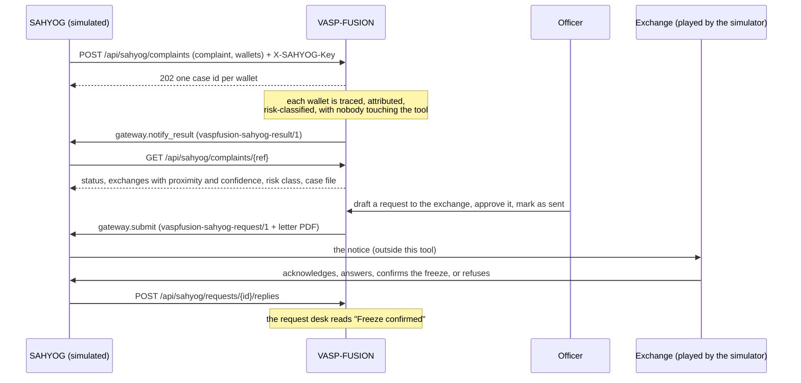

# SAHYOG contract: both directions

**What this is, and what it is not.** SAHYOG is the I4C portal through which complaints and notices move between law enforcement and intermediaries. **Its real interface is not public**, so VASP-FUSION has never called it and nothing in this repository is a description of SAHYOG's API. This document is **our side of a contract**: the routes VASP-FUSION offers, the JSON it accepts and hands back, and the interface a gateway must implement. It is a proposal for I4C to map onto the real portal. When the real interface is known, three things change and nothing else: the field names of the intake body are mapped to the portal's own (`vaspfusion/api/schemas.py::ComplaintCreate`), the authentication becomes whatever the portal requires (today a shared API key), and `MockSahyogGateway` is replaced by a gateway that calls the portal (`make_gateway()` in `vaspfusion/api/main.py`). The trace, the desk, the letter and the status machine do not change.

**What exists today.** The intake and reply routes below are live and tested (`tests/api/test_sahyog_intake.py`). The one gateway, `MockSahyogGateway`, writes everything that would cross to the portal into a folder (`data/sahyog_outbox/`, or `VASPFUSION_SAHYOG_OUTBOX`). **Nothing leaves the machine.** The screen at `/sahyog-sim` plays the portal's side so the round trip can be shown; it carries the banner "A simulator for demonstration. Not the SAHYOG portal." and uses no emblem, logo or styling of the real portal.

Code: `vaspfusion/desk/intake.py` (key, result payload, complaint state), `vaspfusion/desk/gateway.py` (interface, mock), `vaspfusion/desk/service.py` (requests and replies), `vaspfusion/store/complaints.py`, the routes in `vaspfusion/api/main.py`.

## The round trip



## 1. Authentication

- Header **`X-SAHYOG-Key`** on every `/api/sahyog/*` call. It is compared in constant time with `SAHYOG_API_KEY` (environment), or, when that is not set, with the file `data/sahyog_api_key` (`VASPFUSION_SAHYOG_KEY_FILE`).
- The key is **separate from the officer login**: these routes do not take an officer's session, and an officer's session does not open them. With no key configured they answer **503**; with a missing or wrong key, **401**.
- A demonstration key is created only by the demo set-up (`make demo` / `cli demo`): random, written once, never printed. The simulator's own routes (`/api/sahyog-sim*`) sit behind the officer login and call the same functions on the server, so the browser never holds the key.
- Every call is written to the audit log (`sahyog.complaint`, `sahyog.status`, `sahyog.reply`, `sim.*`), refused ones included.
- **Not there:** no request signing, no key rotation, no rate limit, no IP allow-list. A real deployment needs what the portal mandates.

## 2. Complaint in: `POST /api/sahyog/complaints`

| Field | Type | Meaning |
|---|---|---|
| `complaint_ref` | string, 3 to 64 of letters, digits, `.`, `_`, `-` | the NCRP / 1930 acknowledgement number. The idempotency key, with the address |
| `agency` | string, 1 to 200 | the reporting agency |
| `officer` | string, 1 to 200 | the reporting officer |
| `wallets[]` | 1 to 50 of `{address, chain?}` | `chain` is read from the address when absent |
| `amount_lost_inr` | number ≥ 0, optional | |
| `incident_date` | date, optional | the trace then reads transfers from that day on |
| `category` | one of `investment_fraud`, `job_fraud`, `impersonation`, `phishing`, `ransomware`, `extortion`, `loan_app`, `other` | **our own short list**; the portal's categories would replace it |
| `note` | string up to 2000, optional | |
| `callback_url` | string up to 500, optional | recorded and passed to the gateway in the result. **The mock gateway never calls it** |

Behaviour:
- Every address is validated. **One case is opened per valid wallet and its trace starts at once** (three hops, as an officer's default). The cases are ordinary cases: they appear in the list, on the dashboard and on the desk, and read "Reported through SAHYOG · ‹ref›".
- **202** with the complaint's state (`ComplaintStatus`, below). The wallets are traced one after another by the server's background queue.
- **Idempotent on `complaint_ref` + address.** The same complaint again returns the same cases and traces nothing. A wallet added to a known complaint is traced; the others are left alone. A wallet that already has a finished case is linked to it and its result is handed back at once.
- **A bad address is refused with a sentence that names it** (`wallets[].accepted: false`, `error`); the valid ones still go through.

Status codes and their sentences (`detail`):

| Status | When | Sentence |
|---|---|---|
| 202 | accepted | (the body) |
| 401 | no key or a wrong one | "The X-SAHYOG-Key header is missing or wrong." |
| 422 | a field is malformed | the field and what is wrong with it |
| 422 | no wallet could be accepted | "No wallet in this complaint could be accepted. ‹address›: ‹why›" |
| 503 | no key is configured | "The SAHYOG intake is not configured on this installation: no API key is set (SAHYOG_API_KEY)." |
| 503 | the label database is missing | "The label database is missing. Run `make labels` first." |

## 3. Result back

### `GET /api/sahyog/complaints/{complaint_ref}` → `ComplaintStatus`

`complaint_ref`, `agency`, `officer`, `category`, `note`, `amount_lost_inr`, `incident_date`, `callback_url`, `received_at`, `status_url`, and:

- `status`: `received` (nothing traced yet), `tracing` (a wallet is queued or being traced), `result` (every accepted wallet has a result or has failed).
- `wallets[]`, one per wallet sent:

| Field | Meaning |
|---|---|
| `address`, `chain` | as traced (an EVM address in lower case) |
| `accepted`, `error` | `false` with the sentence, for a refused address |
| `case_id` | the case opened for it |
| `status` | `refused`, `received`, `tracing`, `result`, `failed` (`case_error` says why) |
| `outcome` | `ATTRIBUTED`, `INSUFFICIENT_EVIDENCE` or `SANCTIONED_OR_MIXER_REACHED` |
| `top_vasp`, `confidence` | the exchange the case names, if it names one |
| `exchanges[]` | every exchange the trace reached, nearest first: `vasp`, `direction`, `proximity_rank`, `hops`, `confidence`. **Proximity and confidence are separate**; only `top_vasp` is named |
| `risk_class`, `risk_score` | Low, Medium, High or Severe, and 0 to 100. **An indicator score from published red-flag rules, not a probability; `risk_basis` says what it was checked on** |
| `report_pdf` | the case file, `/api/cases/{id}/pdf` (needs an officer's session) |
| `request_ids[]` | requests drafted from this case, withdrawn ones left out |
| `result_sent_at` | when the result was handed to the gateway |

404: "No complaint ‹ref› has been received."

### `gateway.notify_result`: the payload `vaspfusion-sahyog-result/1`

When a wallet's trace finishes, its result is handed to the gateway. The mock writes `results/<complaint_ref>__<case_id>.json` in the outbox.

```json
{
  "schema": "vaspfusion-sahyog-result/1",
  "complaint_ref": "NCRP-2026-0001",
  "callback_url": null,
  "sent_at": "2026-10-05T04:12:09Z",
  "wallet": {"address": "TYJD2hZKBNrcKW2gYUTV6rJJ2nYie2HP1c", "chain": "tron",
             "case_id": "c-3f0e1b2a9d", "status": "result", "outcome": "ATTRIBUTED",
             "top_vasp": "CoinDCX", "confidence": 0.8491,
             "exchanges": [{"vasp": "CoinDCX", "direction": "outbound", "proximity_rank": 1,
                            "hops": 1, "confidence": 0.8491}],
             "risk_class": "low", "risk_score": 0,
             "report_pdf": "/api/cases/c-3f0e1b2a9d/pdf"},
  "risk_basis": "An indicator score from published red-flag rules. Not a probability. Checked on 65 wallets that public sources list as illicit and 70 with a documented ordinary purpose, each with its own label hidden: 14 of 65 and 2 of 70 scored High or above, all of those through a link to another listed address. No pattern rule fired more often on the listed wallets than on the ordinary ones. The points were not fitted to these wallets, which are not a sample of real complaints.",
  "generated_by": {"tool": "VASP-FUSION", "code_version": "b5-bitcoin-1"}
}
```

A failed hand-over does not fail the case: the portal can always read the result from the status route.

## 4. Request out: the payload `vaspfusion-sahyog-request/1`

Written to the outbox as canonical JSON (sorted keys, UTF-8, no spaces), so `payload_sha256` can be checked by anyone holding the file.

| Field | Type | Meaning |
|---|---|---|
| `schema` | string | `vaspfusion-sahyog-request/1` |
| `request_id` | string | `req-<year>-<number>`, unique on this installation |
| `reference` | string | the reference printed on the letter, `VF/REQ/<year>/<number>` |
| `created_at` | UTC timestamp | when the request was drafted |
| `draft` | bool | `true` until approved. **A gateway must refuse `true`.** |
| `recipient` | object | `vasp` (trade name), `legal_name`, `jurisdiction`, `fiu_ind_registered`, `fiu_ind_as_of`, `channel` (the exchange's own published law-enforcement channel). From `data/vasp_directory.yaml`; `null` where no source was found |
| `officer` | string | who makes the request, as typed |
| `subject` | string | the letter's subject line |
| `cases[]` | objects | `case_id`, `case_ref`, `complaint_no`, `wallet` (the wallet under investigation), `chain` |
| `wallets[]` | objects | one per wallet the exchange is asked about, below |
| `asks[]` | strings | any of `kyc`, `transactions`, `freeze`, `preservation`, in that order |
| `legal_basis` | object | `text` (the line on the letter) and `citations[]` (`section`, `act`, `heading`, `url`) |
| `documents[]` | objects | empty until sent; then the letter: `name`, `media_type`, `sha256` |
| `generated_by` | object | `tool`, `code_version` |

`wallets[]`:

| Field | Meaning |
|---|---|
| `address`, `chain` | the wallet, in full |
| `case_id` | the case it comes from |
| `asset`, `amount` | the traced funds that went through this wallet to the exchange, exact. One row per wallet; the rows of a case add up to what reached the exchange |
| `amount_usd` | the same amount when the asset is a US-dollar stablecoin, else `null` (no price feed) |
| `evidence_tier` | of the label that names the exchange: `published_por`, `curated`, `explorer_tag`, `derived` |
| `confidence` | the case's confidence for this exchange (0 to 1). An assessment, not proof |
| `first_seen` | when the traced funds first reached the wallet (UTC) |
| `tx_hashes[]` | the transactions of the route, in full |
| `paid_into` | set when `address` carries no label itself: the exchange's labelled wallet it passed everything on to |

Example (a real demo wallet, shortened to one wallet):

```json
{
  "schema": "vaspfusion-sahyog-request/1",
  "request_id": "req-2026-0002",
  "reference": "VF/REQ/2026/0002",
  "created_at": "2026-10-02T09:30:00Z",
  "draft": false,
  "recipient": {"vasp": "CoinDCX", "legal_name": "Neblio Technologies Private Limited",
                "jurisdiction": "India", "fiu_ind_registered": true,
                "fiu_ind_as_of": "2023-12-04", "channel": null},
  "officer": "Insp. A. Rao, Cyber PS",
  "subject": "Request for KYC records and a freeze in respect of 1 wallet attributed to CoinDCX (DEMO/2026/104)",
  "cases": [{"case_id": "tron-htx-coindcx", "case_ref": "DEMO/2026/104", "complaint_no": null,
             "wallet": "TGfoGrh8ddh4zzpBe3G82p1tgmeUq49sWr", "chain": "tron"}],
  "wallets": [{"address": "TLUQsVHsmUrcWEy3tGrpEdh2ue8z2NHPYk", "chain": "tron",
               "case_id": "tron-htx-coindcx", "asset": "USDT", "amount": 6000.0,
               "amount_usd": 6000.0, "evidence_tier": "derived", "confidence": 0.8492,
               "first_seen": "2024-07-23T08:44:12Z",
               "tx_hashes": ["a12af76b0c4c89cdc0a316d9dc7f23a72b48844f197c0944effb684461f80dae"],
               "paid_into": null}],
  "asks": ["kyc", "freeze"],
  "legal_basis": {"text": "Notice under Section 94 of the Bharatiya Nagarik Suraksha Sanhita, 2023. ...",
                  "citations": [{"section": "94", "act": "Bharatiya Nagarik Suraksha Sanhita, 2023",
                                 "heading": "Summons to produce document or other thing",
                                 "url": "https://www.indiacode.nic.in/handle/123456789/20099"}]},
  "documents": [{"name": "req-2026-0002.pdf", "media_type": "application/pdf", "sha256": "..."}],
  "generated_by": {"tool": "VASP-FUSION", "code_version": "b9-receipt-1"}
}
```

## 5. The gateway interface

```python
class SahyogGateway(Protocol):
    name: str
    def submit(self, payload: dict, pdf: bytes, *, now: datetime) -> dict: ...          # request out
    def sent_pdf(self, request_id: str) -> bytes | None: ...
    def notify_result(self, payload: dict, *, now: datetime) -> dict: ...               # result back
    def record_reply(self, request_id: str, reply: dict, *, now: datetime) -> dict: ... # reply in
```

- `submit` is called once, when the officer moves an **approved** request to `sent` (`PATCH /api/requests/{id}` with `status: "sent"`). `payload` is the JSON of section 4 with `draft: false`; `pdf` is the letter without the draft marks, its SHA-256 in `payload.documents[0].sha256`.
- Every method returns a **receipt**: `gateway`, `receipt_id`, `submitted_at` (UTC), `location`, `payload_sha256`. A request's receipt is stored on it (`RequestDetail.receipt`).
- `submit` raises `GatewayError` if the payload is a draft or the submission did not go through. The request then stays `approved`, with no due date and no receipt, and the API answers 502.
- **Submitting the same payload and letter again must succeed without sending twice** (the desk may have failed after the first submission and will retry). A different payload under an id already submitted is refused.
- `sent_pdf` returns the letter exactly as submitted, if the gateway keeps it. The desk serves those bytes for a sent request, after checking them against the recorded SHA-256.
- Before a request is approved or sent the desk checks that every wallet in it is still what its case says; a gateway never sees a request whose case has changed since the draft.
- The mock's outbox: `<request_id>.json` and `.pdf` (requests), `results/<complaint_ref>__<case_id>.json`, `replies/<request_id>.<status>.json`. All canonical JSON (sorted keys, UTF-8, no spaces), so each `payload_sha256` can be checked by anyone holding the file.

## 6. Reply in: `POST /api/sahyog/requests/{request_id}/replies`

The exchange's reply to a request that was sent, arriving through the portal.

| Field | Meaning |
|---|---|
| `status` | `acknowledged`, `answered`, `freeze_confirmed` or `refused` |
| `note` | up to 500 characters, optional: what the exchange said |
| `reply_ref` | up to 100 characters, optional: the exchange's own reference |

- The reply goes through **the same status machine** as a reply typed in by the officer: sent → acknowledged → answered | freeze_confirmed | refused; answered → freeze_confirmed. The request's history gets an entry with `via: "sahyog"` and the note "Reply received through SAHYOG (‹gateway›)…", and the gateway keeps the reply (`vaspfusion-sahyog-reply/1`: `request_id`, `status`, `note`, `reply_ref`, `received_at`).
- **200** `ReplyAck`: `request_id`, `status`, `recorded_at`, `location` (where the gateway kept it; null when nothing changed).
- A reply that repeats the request's present status changes nothing and answers 200.

| Status | When | Sentence |
|---|---|---|
| 401 / 503 | the key, as in section 1 | |
| 404 | unknown request | "No request ‹id›." |
| 409 | the request was never sent | "Request ‹id› has not been sent, so there is nothing to reply to." |
| 409 | the reply cannot follow | "A request that is ‹status› cannot become ‹status›. Next: … " or "It is closed." |
| 422 | not a reply status | the field and what is wrong with it |
| 502 | the gateway could not keep the reply | "The reply was not recorded: …" |

## 7. The simulator's routes (officer session, not part of the contract)

`GET /api/sahyog-sim` (`SahyogSim`: `enabled`, `notice`, `why_disabled`, `categories`, `complaints[]` as in section 3, `requests[]` = sent requests with `allowed_replies[]`), `POST /api/sahyog-sim/complaints` (the body of section 2; the same intake), `POST /api/sahyog-sim/requests/{id}/reply` (the body of section 6; the same reply leg). They answer 503 when no key is configured. They exist to demonstrate the contract and would not ship in a deployment connected to the real portal.

## What is not in the contract

- **Identity.** Nothing signs a payload or proves who the officer or the exchange is. The API key identifies the caller as "the portal", no more.
- **Delivery to the exchange.** The directory records each exchange's own published channel (a portal or an address) for the officer's use. The tool does not submit to those channels.
- **Callbacks.** `callback_url` is carried, never called.
- **Volume.** A complaint's wallets are traced one after another in one process. Measured on 5 Oct 2026: one complaint with the 12 recorded wallets (six chains), intake to 12 results, **6.3 seconds** (four runs, all between 6.3 and 6.4, on a quiet machine) with chain responses replayed and no network (`make intake-timing`, `artifacts/intake_timing.json`). A live trace also waits on the public chain APIs.

## Legal basis cited

| Section | Act | Heading | Used for |
|---|---|---|---|
| 94 | Bharatiya Nagarik Suraksha Sanhita, 2023 | Summons to produce document or other thing | every request |
| 63 | Bharatiya Sakshya Adhiniyam, 2023 | Admissibility of electronic records | every request (the certificate that must come with electronic records) |
| 106 | Bharatiya Nagarik Suraksha Sanhita, 2023 | Power of police officer to seize certain property | only when a freeze is asked |

Texts: India Code, <https://www.indiacode.nic.in/handle/123456789/20099> (BNSS) and <https://www.indiacode.nic.in/handle/123456789/20063> (BSA). The wording on the letter is a draft for the officer to review. It is not legal advice.
